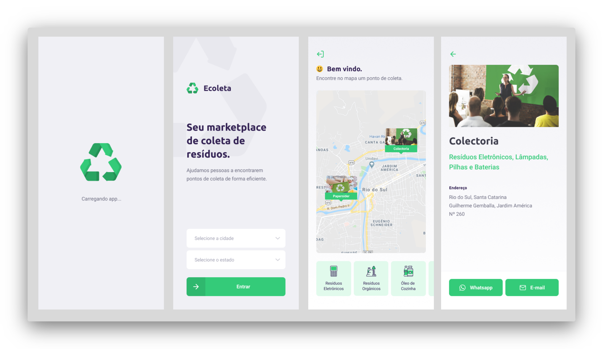

<p align="center">
  
</p>

<p align="center">
  

  

  <a href="https://github.com/fariasmateuss/ecoleta/issues">
    
  </a>

  
</p>
 


## About this Project

App waste collection marketplace built with Restful API in NodeJs, TypeScript, ReactJS, React Native and more.

## Why?

Ecoleta is an application that aims to help people find places that collect specific types of waste, encouraging people to recycle more.



## Tech

- TypeScript
- Node
- React
  - React Icons
  - React Leaflet
  - React Dom
  - React Router Dom
- React Native
  - React Native Maps
  - React Navigation
  - React Native Gesture Handler
  - React Native Reanimated
  - React Native Safe Area Context
  - React Native Screens
  - React Native Svg
  - React Native Web
- Expo
  - Expo Font
  - Expo Location
  - Expo Mail Composer
- SQLite3
- Join
- Express
- Knex
- CORS
- Axios
- Multer 
- ESlint
- Prettier

## Development setup

### Prerequisites

To run this project in the development mode, you'll need to have a basic environment with NodeJs installed. 

**Cloning the Repository**

```
$ git clone https://github.com/fariasmateuss/ecoleta.git
```

### Installing 

**Back-End**

- Run `npm install` in the `server` folder;
- Run `npm run server` to up the server;

**Front-End** 

- Run `npm install` in the `web` folder;
- Run `npm start` to up the project;

**Mobile** 

- Run `npm install` in the `mobile` folder
- Update the baseURL at src/services/api.js.
- Run `expo start` to up the project.
  
## Contribution

See the [contribution guide](CONTRIBUTING.md) for more details on how to contribute to this project.

# License
[MIT License](/LICENSE)
